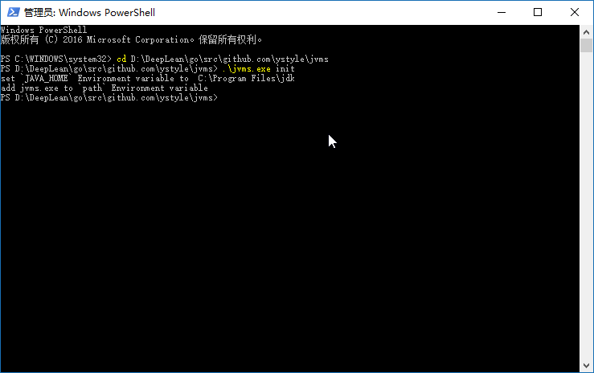
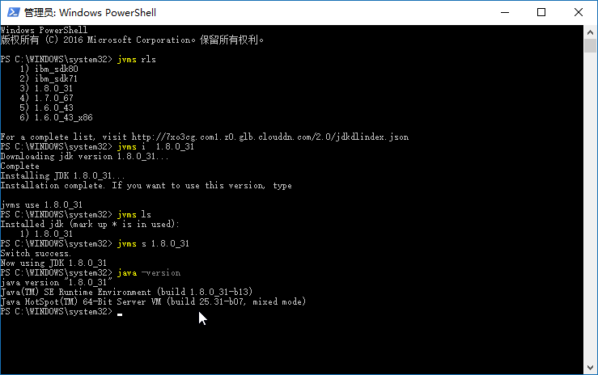

# JDK Version Manager (JVMS) for Windows（Windows JDK 版本管理器 ）

**📝[English Document](https://github.com/AienH/jvms/blob/main/README_EN.md)**

管理 Windows 计算机上的多个 JDK 安装。 [JVMS](https://github.com/ystyle/jvms)，[立即下载](https://github.com/ystyle/jvms/releases)！

在某些情况下，在不同版本的 JDK 之间切换的能力会非常 有用。例如，如果您想测试使用最新 前沿版本开发的项目而不卸载 JDK 的稳定版本，此实用程序可以提供帮助。

### 安装

- [现在下载](https://github.com/ystyle/jvms/releases)
- 解压zip并将jvms.exe复制到你想要的路径
- 以管理员身份运行 cmd 或 powershell
- cd 到文件夹`jvms.exe`所在的位置
- 跑步`jvms.exe init`
- 设置完成！切换并安装 jdk 参见[用法](#usage)部分

 

### 用法

```
NAME：
   jvms -适用于Windows 的JDK 版本管理器 (JVMS)

USAGE:
   jvms.exe [全局选项] 命令 [命令选项] [参数...]

VERSION:
   2.0.0
   
COMMANDS:：
     init        初始化配置文件
     list, ls    列出 JDK 安装。
     install, i  安装远程可用的jdk
     switch, s   切换到使用指定的版本。
     remove, rm  删除特定版本。
     rls         显示可供下载的版本列表。
     proxy       设置用于下载的代理。
     help, h     显示命令列表或一个命令的帮助

GLOBAL OPTIONS:
   --help , -h     显示帮助
   --version , -v  打印版本
```

如何安装和切换jdk。看：

- 以管理员身份运行 cmd 或 powershell
- `jvms rls` *列出可供下载的可用 jdk 版本*
- `jvms install 1.8.0_31` *安装 jdk 1.8.0_31*
- `jvms ls` *列出已安装的jdk*
- `jvms switch 1.8.0_31` *将 jdk 版本切换到 1.8.0_31*

 

## 最大的不同是什么？

首先，这个版本的 jvms 不依赖于其他库。它是用[Go](http://golang.org/)编写的，与绕过有限文件`.bat`进行黑客攻击相比，这是一种更加结构化的方法 。它不依赖于现有的 jdk 安装。

控制机制也大不相同。有两种通用的方式来支持具有热切换功能的多个 jdk 安装。 第一种是在任何时候切换版本时修改系统`PATH`，或者通过使用`.bat`文件模仿 jdk 可执行文件并相应地重定向来绕过它。这对我来说总是有点老套，而且这个实现有一些怪癖。

第二种选择是使用符号链接。这个概念需要将符号链接放入系统中`PATH`，然后将其目标更新为 您要使用的 jdk 安装目录。这是一种直接的方法，似乎是人们推荐的方法……直到他们 意识到 Windows 上的符号链接有多么痛苦。这就是为什么它以前没有发生过。

为了创建/修改符号链接，您必须以管理员身份运行，并且必须绕过 Windows UAC（那个烦人的提示）。因此，JVMS for Windows会维护一个符号链接，该符号链接仅在`PATH`运行期间放入系统`jvms init`中。切换到不同版本的 JDK 就是切换符号链接目标。因此，该实用程序不需要您在每次打开控制台窗口时都运行`jvms switch x.x.x`。当您运行时 `jvms switch x.x.x`时，jdk的活动版本会在所有打开的控制台窗口中自动更新。它还会在系统重启之间持续存在，因此您只需在想要进行更改时使用 jvms。 

总的来说，这个项目汇集了一些想法，其他模块的一些经过实战考验的部分，以及对JDK新版本的支持。

我还编写了一个包含 jdk 版本列表的简单[数据提要](http://github.com/ystyle/jvms)。任何人都可以免费使用。

### 添加本地jdk版本

例如：添加`jdk 17.0.1`

1. 将 jdk 主文件夹复制到`jvms/store`
2. 将文件夹重命名为`17.0.1`
3. `jvms list`检查这个
4. `jvms switch 17.0.1`
5. `java -version`检查jdk版本 

## 创建自己的本地下载服务器

- 创建一个 json 文件。例如。`index.json`

- 添加你的jdk下载链接。格式是这样的：

  ```json
  [
    {
    "version":"1.9.0",
      "url":"http://192.168.1.101/files/jdk/1.9.0.zip"
    },
    {
    "version":"1.8.0",
      "url":"http://192.168.1.101/files/jdk/1.8.0.zip"
    }
  ]
  ```

  
  
  
  
- 将此文件复制到静态文件服务器，如 nginx、apache 等。

- `jvms init --originalpath http://192.168.1.101/files/index.json`顺便运行一下，`jvms init --java_home`可以修改默认的JAVA_HOME

- 运行`jvms rls`或`jvms install x`将列出或安装您的 jdk 版本

### 创建一个 jdk zip 文件

- 打开 jdk_home 文件夹
- 压缩所有文件到`*.zip`文件
- 将 zip 文件复制到您的服务器
- 将此 zip 文件链接添加到 index.json


